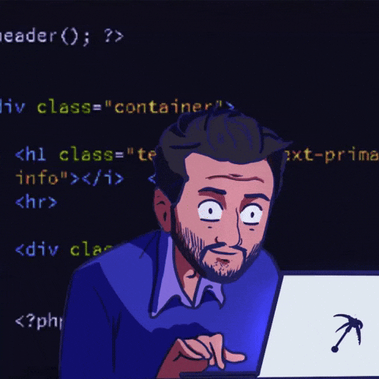
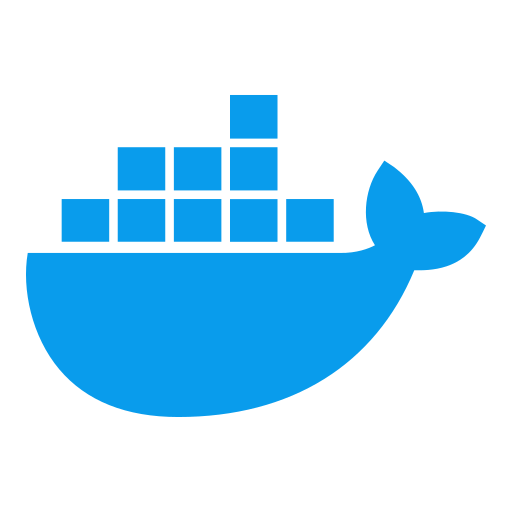
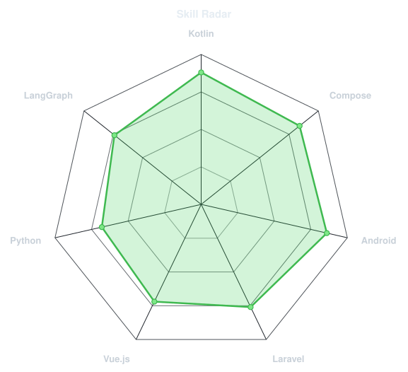
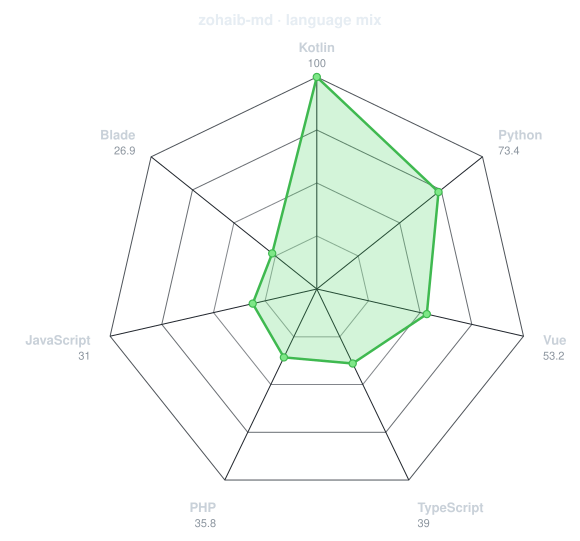
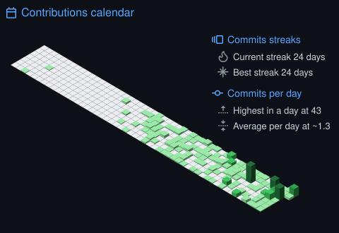
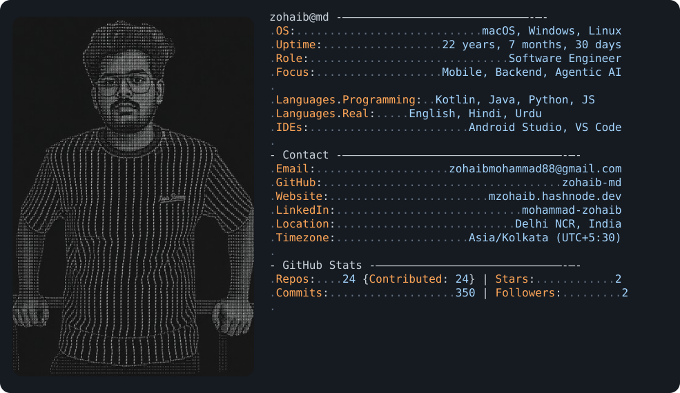
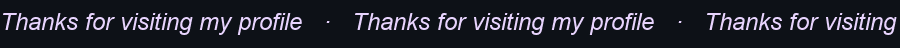

<div align="center">


### Mohammad Zohaib

[](https://git.io/typing-svg)

<br/>

<a href="https://www.linkedin.com/in/mohammad-zohaib-279794204/"></a>
<a href="https://mzohaib.hashnode.dev"></a>
<a href="https://github.com/zohaib-md"></a>
<a href="https://github.com/zohaib-md"></a>

</div>

---

## `~/` whoami



```console
$ cat about.txt
```

Hi, I'm **Mohammad Zohaib**. Software developer — I ship across mobile, backend, and AI, and pick up whatever stack the problem needs.

Lately I'm hooked on **AI orchestration** — multi-agent systems that collaborate in production, not just demos.

- Currently: **Software Development Intern @ [Hyperzod](https://www.hyperzod.com)** — multi-tenant integrations and multi-agent orchestration
- Previously: **Android Developer Head @ Lettrblack** — led a team of 5 and shipped production apps
- Writing: **[mzohaib.hashnode.dev](https://mzohaib.hashnode.dev)**
- Education: **B.Tech Information Technology, AKGEC (2023–2027)**

<br clear="both"/>

---

## `~/` toolbox 

<div align="center">
  
</div>

### Technical Skills
<div align="center">
  <a href="https://www.python.org" target="_blank"></a>
  &nbsp;
  <a href="https://www.djangoproject.com" target="_blank"></a>
  &nbsp;
  <a href="https://react.dev" target="_blank"></a>
  &nbsp;
  <a href="https://developer.mozilla.org/en-US/docs/Web/JavaScript" target="_blank"></a>
  &nbsp;
  <a href="https://www.typescriptlang.org" target="_blank"></a>
  &nbsp;
  <a href="https://github.com" target="_blank"></a>
  &nbsp;
  <a href="https://www.mysql.com" target="_blank"></a>
  &nbsp;
  <a href="https://www.docker.com" target="_blank"></a>
</div>

###  Languages
<p>
  <a href="https://kotlinlang.org" target="_blank"></a>
  <a href="https://www.java.com" target="_blank"></a>
  <a href="https://www.python.org" target="_blank"></a>
  <a href="https://www.php.net" target="_blank"></a>
  <a href="https://developer.mozilla.org/en-US/docs/Web/JavaScript" target="_blank"></a>
</p>

###  Web & Backend
<p>
  <a href="https://laravel.com" target="_blank"></a>
  <a href="https://vuejs.org" target="_blank"></a>
  <a href="https://react.dev" target="_blank"></a>
  <a href="https://nextjs.org" target="_blank"></a>
  <a href="https://nodejs.org" target="_blank"></a>
  <a href="https://expressjs.com" target="_blank"></a>
  <a href="https://pinia.vuejs.org" target="_blank"></a>
  <a href="https://tailwindcss.com" target="_blank"></a>
</p>

### 🗄️ Databases
<p>
  <a href="https://www.postgresql.org" target="_blank"></a>
  <a href="https://www.mongodb.com" target="_blank"></a>
  <a href="https://redis.io" target="_blank"></a>
  <a href="https://www.sqlite.org" target="_blank"></a>
  <a href="https://firebase.google.com" target="_blank"></a>
</p>

###  Android
<p>
  <a href="https://developer.android.com/studio" target="_blank"></a>
  <a href="https://kotlinlang.org" target="_blank"></a>
  <a href="https://firebase.google.com" target="_blank"></a>
  <a href="https://gradle.org" target="_blank"></a>
</p>

###  Tools
<p>
  <a href="https://git-scm.com" target="_blank"></a>
  <a href="https://github.com" target="_blank"></a>
  <a href="https://github.com/features/actions" target="_blank"></a>
  <a href="https://www.postman.com" target="_blank"></a>
  <a href="https://www.docker.com" target="_blank"></a>
  <a href="https://code.visualstudio.com" target="_blank"></a>
  <a href="https://www.linux.org" target="_blank"></a>
</p>

---

<div align="center">

## `~/` skill radar

<table>
<tr>
<td width="50%" align="center" valign="middle">
<picture>
<source media="(prefers-color-scheme: dark)" srcset="assets/radar-dark.svg">
<source media="(prefers-color-scheme: light)" srcset="assets/radar-light.svg">

</picture>
</td>
<td width="50%" align="center" valign="middle">
<picture>
<source media="(prefers-color-scheme: dark)" srcset="assets/radar-langs-dark.svg">
<source media="(prefers-color-scheme: light)" srcset="assets/radar-langs-light.svg">

</picture>
</td>
</tr>
</table>

</div>

---

<div align="center">

## `~/` contribution calendar



</div>

---

##  GitHub Stats

<div align="center">

<br/>
<br/>


</div>

---

## Snapshot

<div align="center">

<picture>
  <source media="(prefers-color-scheme: dark)" srcset="assets/snapshot-ascii-dark.svg">
  <source media="(prefers-color-scheme: light)" srcset="assets/snapshot-ascii-light.svg">
  
</picture>

</div>

---

## &nbsp;Contribution Snake

<div align="center">


</div>

---

<div align="center">


*Building thoughtful software, one idea at a time.*



</div>
